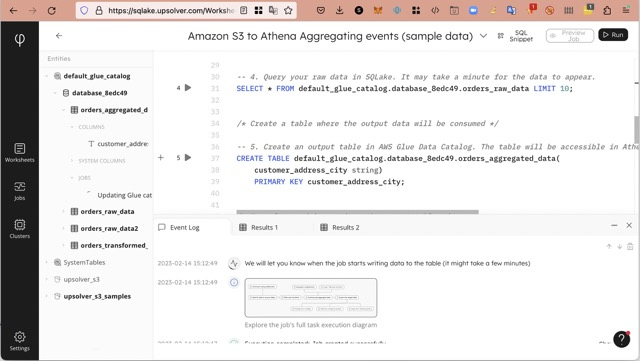
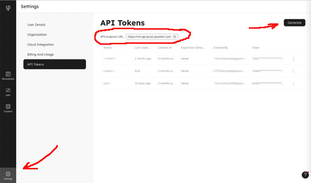

# Using Upsolver with DBAPI in python

## What is Upsolver

[Upsolver](https://upsolver.com) is a Data Preparation Platform that lets you prepare and deliver data at massive scale in a matter of minutes. Citing another [review on G2](https://www.g2.com/products/upsolver/reviews):

```text
Upsolver lets you build at-scale data pipelines in days rather than months.
You can ingest complex and streaming data via built-in connectors,
define transformations using SQL commands,
and output tables continuously to your data lake or cloud data warehouse. 
With Upsolver you can deliver analytics pipelines 10X faster
and make your data engineering 10X more productive.
```

According to [crunchbase](https://www.crunchbase.com/organization/upsolver):

```text
Upsolver lets you build continuous pipelines for your cloud data lake
using SQL and pipeline automation.
```

## SQL Lake

[SQL Lake](https://sqlake.upsolver.com) is Upsolvers new UI and SQL console allowing to execute commands and monitor pipelines in the UI. It also includes freee trial and access to variety of examples and tutorials.



## What is DB API

Pythonic dbapi defined in [pep-249](https://peps.python.org/pep-0249/)

```text
...  to encourage similarity between the Python
modules that are used to access databases.
```

Many python libraries know to work with DB API connections out of the box, for example `pandas`, `SQLAlchemy` etc.

## Getting started

### Install Upsolver SDK for Python

```bash
# For release version:
pip install upsolver-sdk-python
# for latest development version
pip install git+https://github.com/Upsolver/upsolver-sdk-python
....
....
Installing collected packages: upsolver-sdk-python
  Attempting uninstall: upsolver-sdk-python
    Found existing installation: upsolver-sdk-python 0.1.0
    Uninstalling upsolver-sdk-python-0.1.0:
      Successfully uninstalled upsolver-sdk-python-0.1.0
Successfully installed upsolver-sdk-python-0.1.0
```

### Register Upsolver accoount

To register just navigate to [SQL Lake Sign Up form](https://sqlake.upsolver.com/signup). You'll have access to SQL workbench with examples and tutorials after completing the registration.

### Create API token

After login navigate to "[Settings](https://sqlake.upsolver.com/Settings)" and then to "[API Tokens](https://sqlake.upsolver.com/Settings/api-tokens)"

You will need API token and API Url to access Upsolver programatically.



Then click "Generate" new token and save it for future use.

## Connections and cursors

Pythonic access to SQL follows several simple steps:

- create `Connection`
- create `Cursor`
- Query data

```python
# import upsolver DB API
import upsolver.dbapi as upsolver

# Configure your token and URL
token=...
api_url=...

#create connection and cursor
con = upsolver.connect(token=token,api_url=api_url)
cur = upsolver.Cursor(con)

# execute query
res = cur.execute('''
        select
            customer.firstname,
            customer.lastname,
            nettotal as total,
            taxrate
        from default_glue_catalog.database_8edc49.orders_raw_data
        limit 5;
''')

# now we can iterate the results
for r in res:
    print(r)

['John', 'Williams', '415.04', '0.12']
['Richard', 'Miller', '842.1', '0.12']
['Charles', 'Martinez', '1994.6', '0.12']
['Roy', 'Hughes', '0.0', '0.12']
['Teresa', 'Reed', '1080.72', '0.12']
```

The result is not nice, so let's format it before showing here.

```python
from beautifultable import BeautifulTable

res = cur.execute('''
        select
            customer.firstname,
            customer.lastname,
            nettotal as total,
            taxrate
        from default_glue_catalog.database_8edc49.orders_raw_data
        limit 5;
''')

table = BeautifulTable()
table.column_headers = [c[0] for c in cur.description]
for r in res:
    table.append_row(r)
print(table)
+-----------+----------+---------+---------+
| firstname | lastname |  total  | taxrate |
+-----------+----------+---------+---------+
| Samantha  |  Green   | 607.53  |  0.12   |
+-----------+----------+---------+---------+
| Virginia  |  Evans   | 270.02  |  0.12   |
+-----------+----------+---------+---------+
|  Abigail  |  Watson  | 1194.39 |  0.12   |
+-----------+----------+---------+---------+
|    Ann    |  Bailey  | 1655.7  |  0.12   |
+-----------+----------+---------+---------+
|   Kelly   | Edwards  | 1368.78 |  0.12   |
+-----------+----------+---------+---------+
```

For the sake of this article I'm refering to tables that created using the SQL Lake sample "S3 to Athena".

## We can use pandas too

`pandas` is very popular library for data maipulations.
It's possible to rewrite the above example with pandas

```python
import pandas as pd

df = pd.read_sql(query,con=con)
df.info()
<class 'pandas.core.frame.DataFrame'>
RangeIndex: 5 entries, 0 to 4
Data columns (total 4 columns):
 #   Column     Non-Null Count  Dtype 
---  ------     --------------  ----- 
 0   firstname  5 non-null      object
 1   lastname   5 non-null      object
 2   total      5 non-null      object
 3   taxrate    5 non-null      object
dtypes: object(4)
```


## Upsolver SQL

Upsolver supports very limited SQL syntax and not intended to work as SQL query engine. It's rather a tool for creating data pipelines using SQL syntax.

At the time of writing the SQL supports only:

- CREATE/ALTER/DROP table
- CREATE/ALTER/DROP connection
- CREATE/ALTER/DROP job

whever DML flavor supported mostly as part of the job definition. However Upsolver constantly improves and enhances the functionality and hereafter this article publication the SQL syntax may be enhanced.

## Further reading

[Documentation](https://docs.upsolver.com/sqlake/sql-command-reference) of Upsolver SQL

[upsolver-sdk-python](https://github.com/Upsolver/upsolver-sdk-python) - GitHub repository with upsolver SDK for Python language

[Upsolver](https://upsolver.com) website

[SQL Lake](https://sqlake.upsolver.com/) main page

[Python examples from this README](doc/dbapi-ex.py)
